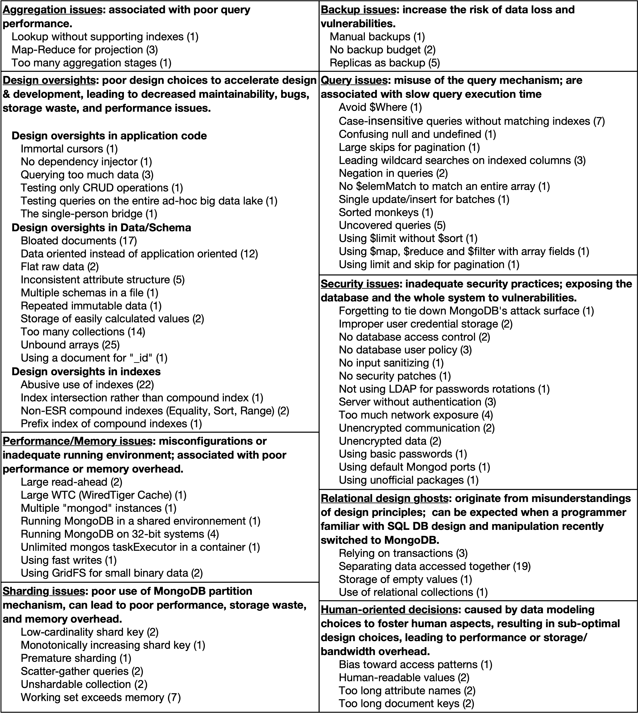

# A Multivocal Mapping Study of MongoDB Smells

Online appendix of the paper "A Multivocal Mapping Study of MongoDB Smells" submitted to the Research Track of [SANER 2024](https://conf.researchr.org/home/saner-2024).

# MongoDB Smell Catalog

Material for RQ1, "What types of MongoDB smells have been proposed in the community?" (Mapping based on smell types.)

 - [Final classification](MLM/classification.csv)
 - [Sources included](MLM/sources_kept.csv) -- (with "Sx" IDs, as referenced in the paper)
 - [Sources excluded](MLM/sources_excluded.csv)
 
Material for RQ2, "Where are MongoDB smells discussed by the community?" (Mapping based on source types.)

 - [Sources classification](MLM/sources_classification.csv)
 - [Sources of smells](MLM/sources_used.csv)
 - [Smells name merging](MLM/merging_names.csv)
 - [Smells induced by sources](MLM/smells_induced.csv)
 - [Sources-Smells network](MLM/network.svg)
 
 

# Automatic Detection of Relational Design Ghosts

Source code of the static analysis and results on open-source JavaScript projects.

 - [CodeQL queries](SmellDetection/CodeQL_queries/readme.md)
 - [Studied projects](SmellDetection/Results/projects_stats.csv)
 - [Detected smell instances](SmellDetection/Results/smells.csv)
 - [Notebook with the results](SmellDetection/Results/Analysis.ipynb)
